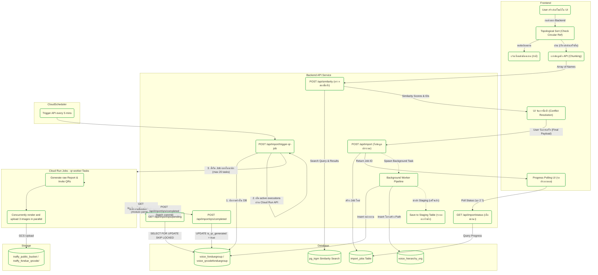
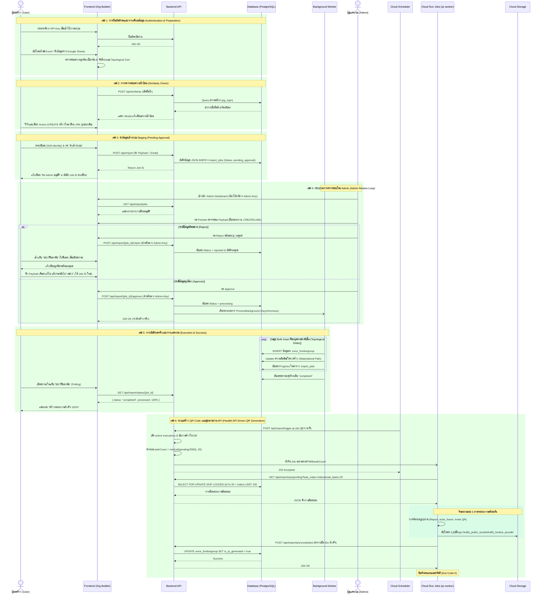

# Organization Chart Creation Tool (Batch Org Create)

เครื่องมือสำหรับจัดเตรียมและวาดผังหน่วยงาน (Organization Chart Builder) ที่ออกแบบมาเพื่อให้ผู้ใช้งานภายนอก (External Users) หรือแอดมิน สามารถสร้าง ลำดับชั้น, นำเข้า/ส่งออกข้อมูลได้อย่างง่ายดาย และเตรียมข้อมูลที่สะอาดเพื่อส่งต่อเข้าสู่ระบบฐานข้อมูลหลัก

## 🚀 สิ่งที่ทำไปแล้ว (Current Features)

1. **Interactive Node Editor:**
   - สร้าง, แก้ไข, ลบ, และเคลื่อนย้ายโหนด (Drag-and-Drop, Move Node).
   - กำหนดชื่อ, ระดับชั้น (Level), และผูกพื้นที่รับผิดชอบ (Areas) ผ่านระบบ Typeahead
2. **Visual & Layout Modes:**
   - **Canvas View:** แสดงผลในรูปแบบ Tree (แนวนอน/แนวตั้ง) พร้อมระบบ Pan & Zoom ด้วยการลากเมาส์ (Mouse Drag) และลูกกลิ้ง (Mouse Scroll).
   - **Table View:** มุมมองตารางสำหรับดูข้อมูลรวมเชิงลึก รองรับการพับเก็บ/ขยายลำดับชั้น (Expand/Collapse).
3. **Pre-processing & Validation (Client-Side):**
   - ระบบแจ้งเตือนเมื่อพบข้อขัดแย้ง (เช่น โหนดไม่มีชื่อ, ไม่ได้กำหนดสังกัด).
   - ปุ่มลบวงกว้าง (ย้ายทั้งสาย หรือ ลบทั้งสาย).
4. **Import/Export Pipeline:**
   - ส่งออกและนำเข้าข้อมูลได้ในรูปแบบ `.json` และ `.xlsx` สำหรับนำไปใช้งานต่อ.
   - **Google Sheets Link Import:** รองรับการนำเข้าข้อมูลโดยตรงจากลิงก์ Google Sheets ที่ตั้งค่าสิทธิ์เป็นสาธารณะ (Anyone with the link can view) โดยระบบจะสกัดข้อมูลมาประมวลผลให้อัตโนมัติ.
5. **Massive-Scale Export Pipeline (Topological Sort):**
   - การส่งออกไฟล์ JSON สำหรับ Backend มีการรัน **Kahn's Algorithm (Topological Sort)** ก่อนเสมอ เพื่อดักจับปัญหาผังวงกลม (Circular Reference) และการันตีว่าหน่วยงาน "ต้นสังกัด" จะถูกจัดเรียงให้อยู่ก่อนหน้า "ลูกน้อง" เสมอ ป้องกันข้อผิดพลาดในการ Insert ข้อมูลลง Database
6. **Real-time Bulk Similarity Search & Conflict Resolution:**
   - ระบบเชื่อมต่อ API ตรวจสอบรายชื่อซ้ำซ้อนกับฐานข้อมูลจริง (Backend) พร้อมระบบทยอยส่งข้อมูล (Chunking ทีละ 200 รายการ) เพื่อแสดง Progress Bar และป้องกันหน้าจอค้าง
   - ระบบ **3-Tier Semantic Tabs** ในหน้า Conflict Resolution จัดกลุ่มความคล้ายคลึงเป็น 3 ระดับ (คล้ายมาก 90-100%, ปานกลาง 70-89%, คล้ายน้อย 50-69%) แทนที่การใช้ Slider แบบเดิม ช่วยให้ตัดสินใจง่ายขึ้น
   - ปุ่ม **Bulk Actions** (LINK All, CREATE All) ประจำแต่ละแท็บ เพื่อจัดการข้อมูลที่ระดับความคล้ายเดียวกันได้รวดเดียว
   - **Bulletproof Cancellation:** การกดยกเลิกการค้นหาระหว่างทาง ใช้ `AbortController` ควบคู่กับ Fail-safe Flag รับประกันการหยุดลูป API 100% แม้กระทั่งในกรณีที่เกิด Hot Reload (Ghost Process)
7. **Pre-Export Validation Checklist:**
   - ก่อนส่งออกเข้า API จะมีหน้าจอ Checklist บังคับให้ผู้ใช้อ่านและ "ติ๊กยอมรับ" ผลลัพธ์ของข้อมูลที่ผิดปกติ (เช่น ไม่มีต้นสังกัด, ไม่มีพื้นที่) เพื่อป้องกันขยะเข้าฐานข้อมูล

### 🎨 การปรับปรุง UI/UX ล่าสุด (Latest UI/UX Improvements)
- **Left Sidebar Notification Panel:** ย้ายการแจ้งเตือนปัญหา (Issues/Alerts) จากกล่องลอยตัว (Floating Panel) ไปเป็น Sidebar ด้านซ้ายที่สามารถเปิด/ปิดได้ เพื่อเพิ่มพื้นที่ในการแสดงผลบน Canvas และดูรายการทั้งหมดได้สะดวก
- **Synchronized Issue Categories:** ปรับหมวดหมู่การแจ้งเตือน (Issue Categories) ให้ตรงกัน 100% ในทุกหน้า ตั้งแต่หน้าจอยืนยันการนำเข้าข้อมูล ไปจนถึงหน้าจอ Sidebar หลัก เพื่อลดความสับสนเรื่องตัวเลข
- **Smart Category Collapse:** เพิ่มระบบพับเก็บ (Auto-collapse) หมวดหมู่ย่อยที่ไม่มีข้อผิดพลาด (จำนวนเป็นศูนย์) โดยอัตโนมัติ ช่วยให้ Sidebar ไม่รก และยังสามารถกดขยายเพื่อดูสถานะ (ยอดเยี่ยม! ไม่พบปัญหา) ได้
- **Bulk Location Edit & Collapsible Subgroups:** หมวดหมู่ย่อยใน Sidebar สามารถพับเก็บได้ และมีปุ่ม "แก้ไขทั้งหมด" สำหรับอัปเดตพื้นที่รับผิดชอบของหลายหน่วยงานในหมวดหมู่นั้นๆ ได้รวดเดียว (รองรับทั้งกลุ่มพื้นที่ผิดพลาด และกลุ่มไม่มีพื้นที่รับผิดชอบ/หน่วยงานลอย)
- **ระบบ Undo:** เพิ่มปุ่ม Undo เพื่อย้อนกลับการกระทำล่าสุดที่ผิดพลาด ช่วยเพิ่มความปลอดภัยในการแก้ไขข้อมูลโครงสร้างแผนผัง
- **Parent Change Confirmation:** เพิ่ม Modal แบบ 3 สเต็ปในการย้ายต้นสังกัด (เลือกรูปแบบการย้าย -> เลือกต้นสังกัด -> กดยืนยัน) เพื่อให้ผู้ใช้สามารถตรวจสอบข้อมูลความถูกต้องได้ก่อนยืนยันจริง
- **Root Node Support:** สนับสนุนการเปลี่ยน/ตั้งค่าต้นสังกัดใหม่ให้กับหน่วยงานที่เป็น Root (ไม่มีต้นสังกัด)
- **Right Sidebar Re-design:** ปรับปรุงการจัดเรียงในแผงการตั้งค่าใหม่ จัดเรียงตาม ชื่อหน่วยงาน, สายการบังคับบัญชา, พื้นที่รับผิดชอบ, และลูกน้อง พร้อมกับการใช้ ธีมสี Traffy Fondue ตามที่ร้องขอ
- **Node Design Update:** ถอด Icon ออกและเปลี่ยนเป็นปุ่มกดที่ชัดเจนเข้าใจง่าย (ตั้งค่า, ดูหน่วยงานย่อย, เพิ่มหน่วยงาน)
- **Chart Layout Optimization:** ปรับการแสดงผลลูกน้องเป็นแถวละ 5 หน่วยงาน และปรับระยะห่าง (Gap) แนวตั้ง-แนวนอนให้สมมาตร
- **Root Node Highlight:** ขยายขนาดโหนดต้นสังกัด (Parent Node) ให้กว้างขึ้น 2 เท่า เพื่อให้เป็นจุดศูนย์กลางที่โดดเด่น
- **Viewport & Positioning:** แก้ไขปัญหาผังหน่วยงานตกไปอยู่กลางจอ จัดตำแหน่งให้ชิดขึ้นมาอยู่ด้านบน (Top-aligned) เสมอ รวมทั้งตอนโหลด Draft ด้วย
- **Config Panel Reorder:** ปรับปรุงหน้าต่างตั้งค่าหน่วยงาน (Sidebar) ให้รองรับข้อความยาวๆ แบบ Multi-line โดยไม่ถูกตัดคำ และเรียงลำดับหัวข้อ (ชื่อ, ต้นสังกัด, พื้นที่, จำนวนลูกน้อง) ใหม่เพื่อความสะดวก
- **Status Highlight:** แสดงกรอบสีเหลือง/แดงให้เห็นชัดเจนบนโหนดที่มีข้อควรระวัง (Warning) หรือข้อผิดพลาด (Error)
- **Large Dataset Import Optimization:** จำกัดการแสดงผลตัวอย่างการนำเข้าข้อมูล (Preview Cards) ไว้สูงสุด 100 รายการแรก เพื่อป้องกันปัญหาเบราว์เซอร์ค้าง (Browser Freeze) เมื่อผู้ใช้งานนำเข้าไฟล์ขนาดใหญ่ (เช่น `MOE.xlsx` ที่มีมากกว่า 35,000 แถว) โดยระบบยังคงนำเข้าข้อมูลทั้งหมดเข้าสู่ระบบตามปกติเมื่อกดยืนยัน
- **Flexible Excel Hierarchical Headers:** รองรับการดึงข้อมูลและวิเคราะห์ลำดับชั้นจากชื่อคอลัมน์ Excel ที่หลากหลายมากขึ้น เช่น รองรับคอลัมน์ลำดับชั้นของกระทรวงศึกษาธิการ (`ชื่อหน่วยงานภายใต้กระทรวง`, `ชื่อหน่วยงานย่อย`) รวมถึงรองรับการแมปพื้นที่รับผิดชอบผ่านคอลัมน์ `ตำบล/อำเภอ/จังหวัดที่รับผิดชอบ` (Fallback ไปที่ตำบล/อำเภอ/จังหวัดที่ตั้ง หรือตามมาตรฐานเดิมได้)
- **Massive Dataset Support (IndexedDB):** เปลี่ยนระบบบันทึกแบบร่างอัตโนมัติ (Auto-save Draft) จาก `localStorage` ไปใช้ `IndexedDB` (ผ่านไลบรารี `idb-keyval`) ทำให้รองรับไฟล์หน่วยงานขนาดใหญ่ (เช่น 35,000+ รายการ) ได้อย่างปลอดภัยโดยไม่เกิดปัญหา QuotaExceededError (จอขาว)
- **O(N) Performance Optimization:** ปรับปรุงอัลกอริทึมการสร้างโครงสร้างแผนผัง (`orgTree`) และการคำนวณระดับชั้น (`recalculateAllLevels`) ด้วยการใช้ Map Lookup (ความซับซ้อนระดับ O(N)) แทนการค้นหาแบบวนลูป (O(N²)) ส่งผลให้ระบบประมวลผลการคำนวณต้นสังกัดนับหมื่นรายการได้ในเสี้ยววินาที ขจัดปัญหาเบราว์เซอร์ค้างรอกดยืนยัน
- **Double Submission Prevention & Progressive UX:** เพิ่มระบบล็อกปุ่ม (Disabled states) และแสดงไอคอนโหลด (Spinners) ในจังหวะที่ระบบกำลังประมวลผล (เช่น การตรวจสอบรายชื่อซ้ำ หรือการยิง API ส่งออก) เพื่อป้องกันผู้ใช้กดเบิ้ล 
- **100% Conflict Resolution Enforcement:** บังคับให้ผู้ใช้งานต้องจัดการความซ้ำซ้อนให้ครบทุกรายการ (LINK หรือ CREATE) จึงจะสามารถกดปุ่มยืนยันส่งข้อมูลเข้า API ได้

## 🚧 สิ่งที่กำลังจะทำ (Roadmap / Next Steps)

เพื่อให้ระบบสามารถขยายขนาด (Scale) และรองรับการจัดการคุณภาพข้อมูล (Data Quality) ที่มีประสิทธิภาพ จะมีการนำ **Two-Tier Validation Workflow** มาใช้งาน โดยมีแผนงานดังนี้:

1. **Nationwide / Non-spatial Organization Handling (TODO):**
   - หาวิธีจัดการกับหน่วยงานที่ "รับผิดชอบทั้งประเทศ" หรือไม่ได้ผูกติดกับพื้นที่ใดพื้นที่หนึ่ง (Non-spatial) เพื่อให้สามารถบันทึกข้อมูลเข้าสู่ระบบและนำไปใช้งานต่อได้อย่างเป็นมาตรฐาน
2. **Pre-processing (String Sanitization):**
   - ระบบจะทำการลบช่องว่างส่วนเกิน, อักขระพิเศษ, และรวมสระที่ซ้ำกัน (เช่น `เเ` เป็น `แ`) โดยอัตโนมัติ.
3. **Dictionary Normalization & Backend Aliases:**
   - ปรับระบบคำย่อ (Aliases) จากที่ฝังใน Frontend (Hardcoded) ไปใช้ **Database-driven Aliases** 
   - ระบบ Frontend จะดึงคำย่อจากฐานข้อมูล Backend แบบอัตโนมัติ เพื่อให้ส่วนกลางสามารถแก้ไขคำย่อและปรับปรุงได้ตลอดเวลา โดยไม่ต้อง Deploy Frontend ใหม่
   - แปลงคำย่อเป็นคำเต็มมาตรฐาน (เช่น `อบต.` -> `องค์การบริหารส่วนตำบล`) ก่อนตรวจความซ้ำซ้อน.
3. **Location ID Mapping:**
   - แปลงชื่อระดับ ตำบล/อำเภอ/จังหวัด ให้กลายเป็น **รหัสพื้นที่ 6 หลัก (กระทรวงมหาดไทย)** เพื่อป้องกันข้อมูลขยะ (เช่น กทม. vs กรุงเทพมหานคร)
4. **Staging & Admin Review:**
   - ส่งข้อมูลที่ผ่านการ Clean ไปพักใน Staging Database
   - ทำ Fuzzy Matching เพื่อเช็คความคล้ายกับชื่อหน่วยงานที่มีอยู่ในระบบ (แสดงผลให้ User ตัดสินใจล่วงหน้า)
   - แอดมินตรวจสอบ (Review) ครั้งสุดท้ายก่อน นำเข้า (Approve) 
5. **หน้าจอสรุปผลสำเร็จ (Success UI):**
   - หลังจากส่ง API สำเร็จ ควรมีหน้าจอสรุปผล (Summary) ว่าสร้างหน่วยงานใหม่ไปกี่รายการ ผูกของเดิมกี่รายการ พร้อมปุ่มกลับหน้าแรกหรือนำเข้าไฟล์ใหม่

### 🎨 2. การปรับปรุง UX/UI (Frontend UX/UI Enhancements)

- **Mini-map & Canvas Navigation (แผนที่ย่อบนผังขนาดใหญ่):**
  - เมื่อมีจำนวนหน่วยงานระดับพันถึงหมื่นโหนด การลาก Canvas อาจทำให้หลงทาง ควรเพิ่ม Mini-map ที่มุมล่างเพื่อบอกตำแหน่งปัจจุบันของหน้าจอ และปุ่ม "Fit to Screen" หรือ "Center to Root" ให้กลับมาจุดศูนย์กลางได้รวดเร็ว
- **Keyboard Shortcuts & Accessibility (การเข้าถึงและคีย์ลัด):**
  - เพิ่มการรองรับคีย์ลัดพื้นฐาน เช่น `Ctrl+Z` (Undo), `Delete` (ลบโหนดที่เลือก), หรือปุ่มลูกศรเพื่อเลื่อน Canvas 
  - ปรับปรุง Focus Management ภายใน Modal ให้รองรับการกด `Tab` และ `Enter` อย่างสมบูรณ์
- **Onboarding & Tooltips (แนะนำผู้ใช้ใหม่):**
  - เพิ่มระบบทัวร์แนะนำการใช้งานเบื้องต้น (First-time user walkthrough) สำหรับผู้ใช้ใหม่ที่เพิ่งเคยใช้ระบบ
  - เพิ่ม Tooltips คำอธิบายศัพท์เฉพาะ เช่น "Topological Sort", "Fuzzy Search" ให้เข้าใจง่ายขึ้น
- **Skeleton Loading & ETA Progress:**
  - เปลี่ยนหน้าจอโหลด (Spinner) ตอนดึงข้อมูลขนาดใหญ่จาก IndexedDB ให้เป็น Skeleton UI เพื่อให้ดูนุ่มนวลขึ้น
  - เพิ่มการคำนวณและแสดงเวลาที่เหลือโดยประมาณ (ETA) บน Progress Bar ระหว่างการยิง API เช็คชื่อซ้ำ
- **ระบบทำต่อไร้รอยต่อ (Auto-Resume & Session Persistence):**
  - บันทึกการตัดสินใจ (User Resolutions) ลง `IndexedDB` พร้อมผังองค์กร เพื่อป้องกันข้อมูลหายเมื่อกดรีเฟรชหน้าเว็บ
  - หากตรวจสอบพบข้อมูลค้างไว้ จะมีแจ้งเตือนให้ผู้ใช้กด "Resume Check" เพื่อยิง API ข้ามตัวที่เคยเช็คไปแล้ว และทำต่อจากจุดเดิมได้ทันที
- **Dark Mode (โหมดถนอมสายตา):**
  - นำ Tailwind `dark:` mode มาใช้ เพื่อรองรับการทำงานในที่แสงน้อยและลดความล้าของสายตา
- **Responsive Layout for Tablets (รองรับแท็บเล็ต):**
  - ปรับ Sidebar ด้านซ้าย/ขวา ให้สามารถยุบเก็บเป็นปุ่มลอย (Floating Button) หรือ Drawer ได้ เมื่อเปิดใช้งานบนหน้าจอที่เล็กกว่า Desktop

---

## 🏛 System Architecture: End-to-End Pipeline & Contextual UX

สถาปัตยกรรมระบบได้รับการออกแบบมาเพื่อรองรับโครงสร้างแบบ **กราฟ / หลายต้นสังกัด (Multi-parent Graph)** ผ่านแนวคิด **Contextual UX** ที่ให้ผู้ใช้งานทำงานบนโครงสร้างแบบต้นไม้ (Tree) ทีละบริบท เพื่อความเรียบง่ายในการใช้งาน แต่ส่วนหลังบ้านจะแปลงคำสั่งเป็นการผูกข้อมูล (LINK) แบบกราฟโดยอัตโนมัติ

### 1. Flow Chart (ภาพรวมการทำงานของระบบ)

### System Architecture Flowchart


**คำอธิบายสถานะ (Status Legend):**
- 🟩 **กรอบสีเขียว (Completed):** ส่วนที่พัฒนาเสร็จสมบูรณ์ 100% แล้ว
- 🟥 **กรอบสีแดง (Waiting):** ส่วนที่พัฒนาเสร็จแล้ว แต่กำลังรอให้เซิร์ฟเวอร์เปิดสิทธิ์ Database แบบ Read-Write ให้
- 🟨 **กรอบสีเหลืองเส้นปะ (Pending / Roadmap):** แผนงานในอนาคต (Phase ถัดไป)

### 2. Master Sequence Diagram (E2E Workflow)

ครอบคลุมกระบวนการตั้งแต่การเข้าสู่ระบบ, ตรวจสอบความซ้ำซ้อน, รอแอดมินอนุมัติ (Staging) ไปจนถึงการสร้างจริงลงฐานข้อมูล



### 3. Database Schema (รองรับ Multi-parent)
เพื่อการขยายตัวในอนาคต ระบบใช้ฐานข้อมูลแบบ Edge Table เพื่อเก็บเส้นทางแยกระหว่างความสัมพันธ์ของหน่วยงาน (Graph)
- **Table `organizations`:** เก็บข้อมูลพื้นฐาน (`id`, `name`, `metadata`)
- **Table `organization_edges`:** เก็บความสัมพันธ์ (`parent_id`, `child_id`, `root_context_id`) โดย `root_context_id` ใช้แยกบริบทของผัง (เช่น ผัง กทม. หรือ ผังกระทรวงศึกษาฯ) เพื่อให้ผู้ใช้งานสามารถดึงโครงสร้างผังแบบ Tree ออกมาแสดงผลทีละบริบทได้โดยไม่พันกัน

## 🧪 การทดสอบ (Testing)

โปรเจกต์นี้มีการทดสอบ 2 ระดับ เพื่อรับประกันความถูกต้องของระบบ:

### 1. Unit Tests (การทดสอบหน่วยย่อย)
ใช้ **Vitest** ในการทดสอบฟังก์ชันสำคัญของระบบ ปัจจุบันมีทั้งหมด **13 Test Cases** ครอบคลุม 2 โมดูลหลัก:

#### 1.1 การสร้างโครงสร้างข้อมูล (Export Utils) - 5 Cases
ไฟล์: `src/utils/exportUtils.test.js`
- ตรวจสอบฟังก์ชันดึงสายการบังคับบัญชา (Path) ของ Root Node 
- ตรวจสอบ Path ของ Child Node ปกติ
- ตรวจสอบ Path ของโหนดที่มีลูกซ้อนกันหลายชั้น (Deeply Nested)
- ตรวจสอบการจัดการเมื่อไม่พบ ID ของหน่วยงาน (Unknown ID)
- ตรวจสอบความทนทานต่อข้อผิดพลาด เมื่อลิงก์ต้นสังกัดขาด (Broken Parent Links) เพื่อป้องกันลูปอินฟินิตี้

#### 1.2 การดึงข้อมูลข้ามระบบ (Google Sheet Utils) - 8 Cases
ไฟล์: `src/utils/googleSheetUtils.test.js`
- ตรวจสอบความสามารถในการสกัด ID และ GID จาก URL แบบเต็ม
- ตรวจสอบการดึงข้อมูลและใส่ค่า GID ตั้งต้น (Default GID) หากลิงก์ไม่ได้ระบุ
- ตรวจสอบการดึงข้อมูล GID จาก Search Params
- ตรวจสอบการคืนค่า Error หาก URL ที่ให้มาไม่ถูกต้อง
- ตจำลอง (Mock) การดึงข้อมูล CSV สำเร็จ
- จำลองผลลัพธ์ล้มเหลว (เช่น 404 Not Found)
- ดักจับ Error กรณีผู้ใช้ไม่ได้เปิดสิทธิ์แชร์แบบสาธารณะ (หน้าเว็บติด Login HTML)
- ตรวจสอบการแจ้ง Error เมื่อ Spreadsheet ID หายไป
```bash
# รัน Unit Tests ทั้งหมด
npm run test

# รันเฉพาะไฟล์ที่ต้องการทดสอบ
npx vitest run src/utils/googleSheetUtils.test.js
```

### 2. End-to-End (E2E) Tests (การทดสอบระบบจำลอง)
ใช้ **Playwright** เพื่อจำลองพฤติกรรมการใช้งานจริงผ่านเบราว์เซอร์ ครอบคลุม:
- **Import Data**: จำลองการอัปโหลดไฟล์ (CSV/Excel) และการกรอกลิงก์ Google Sheets เพื่อตรวจสอบโครงสร้างหน่วยงาน
- **Export Data**: จำลองการส่งออกข้อมูลไฟล์เป็น CSV

```bash
# รัน E2E Tests
npx playwright test
```

---

## 💻 การติดตั้งและรันโปรเจกต์ (Setup & Run Instructions)

### การรันเซิร์ฟเวอร์บนเครื่องตัวเอง (Local Development)
1. **ติดตั้ง Node.js:** ตรวจสอบให้แน่ใจว่าติดตั้ง Node.js เรียบร้อยแล้ว (แนะนำเวอร์ชัน 18+ หรือ 20+)
2. **ติดตั้ง Dependencies:**
   ```bash
   npm install
   ```
3. **รัน Local Server:**
   ```bash
   npm run dev
   ```
   ระบบจะเริ่มทำงานที่ `http://localhost:5173/` (หรือพอร์ตที่แสดงใน Terminal)

### การรันเทสต์ (Testing)
ระบบใช้เครื่องมือตรวจสอบโค้ดที่รัดกุม โดยแบ่งออกเป็นการทดสอบหน่วยย่อย (Unit Tests) ด้วย Vitest และตรวจโค้ดด้วย ESLint

1. **การตรวจสอบ Lint (Code Quality):**
   ```bash
   npm run lint
   ```
2. **การรัน Unit Tests ทั้งหมด:**
   ```bash
   npm run test
   ```
3. **การทดสอบ Build (สำหรับการใช้งานบน Production):**
   ```bash
   npm run build
   ```

---

## 🔧 การแก้ไขกฎการทำความสะอาดชื่อหน่วยงาน (Data Sanitization & Normalization)

หากต้องการเพิ่มคำย่อ หรือ ปรับแต่งกฎในการกรองคำ/ลบคำออกจากชื่อหน่วยงาน สามารถไปเพิ่มได้ที่ไฟล์ [App.jsx](file:///Users/plagad/work/nstda/mu/batch-org-create/src/App.jsx):

### 1. การเพิ่มคำย่อหรือคำทดแทน (Aliases)
ระบบคำย่อได้ถูกย้ายไปจัดการบนระบบฐานข้อมูล (Backend) แล้ว หากต้องการเพิ่มคำย่อใหม่ สามารถเพิ่มลงในตาราง `voice_fondue_org_aliases` ได้โดยตรงผ่าน Database Script หรือผ่าน Backend
ตัวอย่างการเพิ่มข้อมูลใน SQL:
```sql
INSERT INTO voice_fondue_org_aliases (search_text, replace_text) VALUES ('อบต.', 'องค์การบริหารส่วนตำบล');
```

### 2. การเพิ่มกฎ/ลบคำ (Custom Rules / Sanitization)
ไปที่ฟังก์ชัน `sanitizeString` (ประมาณบรรทัดที่ 138+) แล้วเพิ่มเงื่อนไขการลบหรือการแทนที่คำด้วย Regular Expression เช่น:
- **ตัวอย่างการลบคำออกจากชื่อหน่วยงาน:**
  ```javascript
  cleaned = cleaned.replace(/คำที่ต้องการลบ/g, '');
  ```
- **ตัวอย่างการเปลี่ยนรูปสระ/อักขระพิเศษ:**
  ```javascript
  cleaned = cleaned.replace(/เเ/g, 'แ');
  ```


## 🔗 Backend API Integrations & Documentation

โปรเจกต์นี้ทำงานเชื่อมต่อกับระบบ Backend (`fondue-org-importer`) เพื่อจัดการบันทึกข้อมูลและสร้าง QR Code โดยมีข้อมูลการเชื่อมต่อดังนี้:

- **เอกสารอ้างอิง API v2 (หลัก):** รายละเอียดการเรียกใช้งาน API การสร้าง QR Code และโครงสร้าง ER Diagram มีระบุไว้ที่ [docs/qrcode_api_v2.md (ในส่วนของ Backend)](file:///home/plagad/active/fondue-org-importer/docs/qrcode_api_v2.md)
- **ตัวแปรสภาพแวดล้อมที่เกี่ยวข้อง (Frontend):**
  - ตัวแปร URL สำหรับเรียกใช้ API จะชี้ไปยังเซิร์ฟเวอร์หลักของ backend: [https://fondue-org-importer-api-884122932397.asia-southeast1.run.app](https://fondue-org-importer-api-884122932397.asia-southeast1.run.app)
  - ข้อมูลสำหรับการทำงานกับแบบร่างหน่วยงานขนาดใหญ่ ถูกบันทึกไว้บนเว็บบราวเซอร์ผ่านระบบ **IndexedDB** เพื่อความปลอดภัย

---

## Recent Updates (v2.1)
- **UX Fixes**: Added pagination in conflict resolution to fix UI freezing for 1000+ items.
- **Status Flow**: Automatic email persistence and auto-search in Job Status view.
- **Data Integrity**: Fixed a bug where `locations` was mapped incorrectly, resulting in 0 coverage areas in the database. Now properly reads `org.areas.locations`.

## Recent Updates (v2.2 - Jul 16)
- **Requester Auditing Flow**: Swapped `EmailPromptModal` with `RequesterDetailsModal` to collect email, name, phone, and remarks/note prior to submission.
- **Pre-check Validation Metrics**: Client-side payload exporter now calculates node levels, builds `level_distribution` map, and counts pre-check validation warnings and errors, appending these to the metadata payload.
- **Table and Tree Visualization**: Added a "ดูข้อมูล / ผังสายงาน" button on the Admin Dashboard that opens a modal containing a Table View with paginated lists and a recursive Tree View.
- **Requester Info Persistence**: Requester's contact information is saved dynamically in `localStorage`.
- **Silent Dashboard Auto-Refresh**: Implemented background polling every 15 seconds on the Admin Dashboard to keep job statuses live without blocking spinners.
- **API-Driven Parallel QR Generation**: Scaled the background QR worker to run dynamically up to 20 database-less tasks and process 3 concurrent GCS uploads per organization, finishing 150,000 images under 2.5 minutes.

### บันทึกการตัดสินใจและการทำความเร็ว (Design Decisions & Performance Optimization Log)

เพื่อผลลัพธ์ประสิทธิภาพระดับสูงสุดในการประมวลผลข้อมูลหน่วยงาน 50,000 แห่ง และรูปภาพ 150,000 ใบ ทีมงานได้สถาปนาระบบโดยใช้เทคนิคดังต่อไปนี้:

| เทคนิคการปรับปรุงความเร็ว | เหตุผลทางเทคนิค / ผลลัพธ์ที่ได้ | อัตราความเร็วที่เพิ่มขึ้น |
| :--- | :--- | :--- |
| **BFS Level-by-Level Ingestion** | แบ่งกลุ่มหน่วยงานตามระดับความลึกของผัง (Depth) ด้วย BFS และรันคิวเขียน DB ขนานเฉพาะระดับเดียวกัน เพื่อป้องกันปัญหาระดับชั้นลูกเขียนชนกัน (Parent-Child constraint deadlock) | **ลดจาก 20 นาที เหลือ < 2 นาที** (เร็วขึ้น 10 เท่า) |
| **Database-Less Pure Compute Worker** | แยกส่วนเชื่อมต่อฐานข้อมูลตรง (Direct DB Socket) ออกจาก Worker แล้วดึงคิวงานผ่าน HTTP GET/POST API แทน ทำให้ถอดคอนเทนเนอร์ไซด์คาร์ `Cloud SQL Proxy` ออกได้อย่างถาวร แก้ปัญหา Task ค้างสะสมและค่าใช้จ่ายเกินจำเป็น | **เครื่องปิดตัวลงได้ทันที (Scale-to-Zero)** ป้องกัน Timeout |
| **API Modulo Partitioning** | ใช้เศษเหลือจากการหาร ID (`g.id % total_tasks = task_index`) ร่วมกับ SQL `FOR UPDATE SKIP LOCKED` ในการดึงคิวงานล็อตย่อย ทำให้เครื่องขนานทั้ง 20 เครื่องได้ชุดข้อมูลที่ขาดจากกันอย่างสมบูรณ์แบบโดยไม่ต้องแย่งข้อมูลแถวเดียวกัน | **ปลอดภัยไร้คอขวดแย่งแถวเขียนข้อมูล** (Lock Contention) |
| **Parallel 3-Image Render & Upload** | ภายในหน่วยงานเดียวกัน ใช้ Go routines 3 ตัวในการวาดจัดกรอบและสั่งส่งข้อมูลรูปขึ้น GCS พร้อมกัน (Report QR, none_frame, Invite QR) เพื่อทำลายเวลารอการเชื่อมต่อเน็ตเวิร์กสะสม | **ลดเวลาต่อ 1 หน่วยงานจาก 210ms เหลือ 80ms** (เร็วขึ้น 62%) |
| **Single-Execution Job Lock** | ตรวจสอบ Execution สถานะปัจจุบันของคลาวด์ก่อนกระตุ้นเครื่องใหม่ เพื่อไม่ให้รันงานซ้อนเวลาเดียวกัน และคำนวณจำนวนเครื่อง Task ขนานอย่างยืดหยุ่นตามภาระงานค้างสูงสุด 20 เครื่อง | **ป้องกัน GCS อัปโหลดชนกันสะสม (GCS 429 Rate Limit)** |
| **Batch Completion Commit** | ดึงและส่งข้อมูลยืนยันความสำเร็จผ่าน API เป็นรอบ ล็อตละ 100 รายการ แทนการยิง API ทีละ 1 รายการ เพื่อลดภาระเน็ตเวิร์กและ Database locks | **ลดจำนวนคำขอ HTTP ลง 100 เท่า** (จาก 50k เหลือ 500 ครั้ง) |
