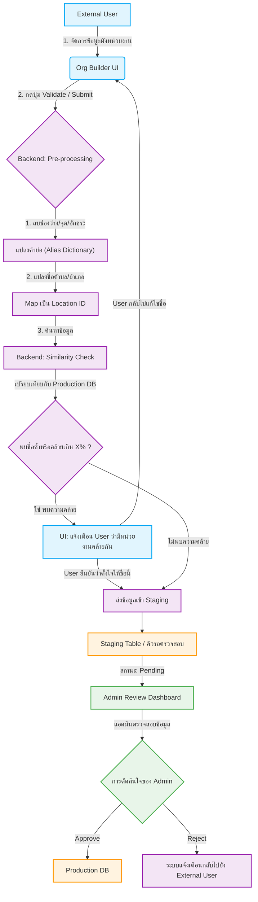
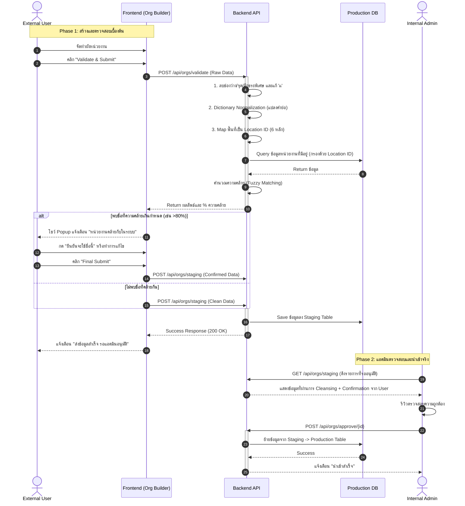

# Organization Chart Creation Tool (Batch Org Create)

เครื่องมือสำหรับจัดเตรียมและวาดผังหน่วยงาน (Organization Chart Builder) ที่ออกแบบมาเพื่อให้ผู้ใช้งานภายนอก (External Users) หรือแอดมิน สามารถสร้าง ลำดับชั้น, นำเข้า/ส่งออกข้อมูลได้อย่างง่ายดาย และเตรียมข้อมูลที่สะอาดเพื่อส่งต่อเข้าสู่ระบบฐานข้อมูลหลัก

## 🚀 สิ่งที่ทำไปแล้ว (Current Features)

1. **Interactive Node Editor:**
   - สร้าง, แก้ไข, ลบ, และเคลื่อนย้ายโหนด (Drag-and-Drop, Move Node).
   - กำหนดชื่อ, ระดับชั้น (Level), และผูกพื้นที่รับผิดชอบ (Areas) ผ่านระบบ Typeahead
2. **Visual & Layout Modes:**
   - **Canvas View:** แสดงผลในรูปแบบ Tree (แนวนอน/แนวตั้ง) พร้อมระบบ Pan & Zoom ด้วยการลากเมาส์ (Mouse Drag) และลูกกลิ้ง (Mouse Scroll).
   - **Table View:** มุมมองตารางสำหรับดูข้อมูลรวมเชิงลึก รองรับการพับเก็บ/ขยายลำดับชั้น (Expand/Collapse).
3. **Pre-processing & Validation (Client-Side):**
   - ระบบแจ้งเตือนเมื่อพบข้อขัดแย้ง (เช่น โหนดไม่มีชื่อ, ไม่ได้กำหนดสังกัด).
   - ปุ่มลบวงกว้าง (ย้ายทั้งสาย หรือ ลบทั้งสาย).
4. **Import/Export Pipeline:**
   - ส่งออกและนำเข้าข้อมูลได้ในรูปแบบ `.json` และ `.xlsx` สำหรับนำไปใช้งานต่อ.
   - **Google Sheets Link Import:** รองรับการนำเข้าข้อมูลโดยตรงจากลิงก์ Google Sheets ที่ตั้งค่าสิทธิ์เป็นสาธารณะ (Anyone with the link can view) โดยระบบจะสกัดข้อมูลมาประมวลผลให้อัตโนมัติ.

### 🎨 การปรับปรุง UI/UX ล่าสุด (Latest UI/UX Improvements)
- **Left Sidebar Notification Panel:** ย้ายการแจ้งเตือนปัญหา (Issues/Alerts) จากกล่องลอยตัว (Floating Panel) ไปเป็น Sidebar ด้านซ้ายที่สามารถเปิด/ปิดได้ เพื่อเพิ่มพื้นที่ในการแสดงผลบน Canvas และดูรายการทั้งหมดได้สะดวก
- **Synchronized Issue Categories:** ปรับหมวดหมู่การแจ้งเตือน (Issue Categories) ให้ตรงกัน 100% ในทุกหน้า ตั้งแต่หน้าจอยืนยันการนำเข้าข้อมูล ไปจนถึงหน้าจอ Sidebar หลัก เพื่อลดความสับสนเรื่องตัวเลข
- **Smart Category Collapse:** เพิ่มระบบพับเก็บ (Auto-collapse) หมวดหมู่ย่อยที่ไม่มีข้อผิดพลาด (จำนวนเป็นศูนย์) โดยอัตโนมัติ ช่วยให้ Sidebar ไม่รก และยังสามารถกดขยายเพื่อดูสถานะ (ยอดเยี่ยม! ไม่พบปัญหา) ได้
- **Bulk Location Edit & Collapsible Subgroups:** หมวดหมู่ย่อยใน Sidebar สามารถพับเก็บได้ และมีปุ่ม "แก้ไขทั้งหมด" สำหรับอัปเดตพื้นที่รับผิดชอบของหลายหน่วยงานในหมวดหมู่นั้นๆ ได้รวดเดียวในคลิกเดียว (Bulk Edit)
- **ระบบ Undo:** เพิ่มปุ่ม Undo เพื่อย้อนกลับการกระทำล่าสุดที่ผิดพลาด ช่วยเพิ่มความปลอดภัยในการแก้ไขข้อมูลโครงสร้างแผนผัง
- **Parent Change Confirmation:** เพิ่ม Modal แบบ 3 สเต็ปในการย้ายต้นสังกัด (เลือกรูปแบบการย้าย -> เลือกต้นสังกัด -> กดยืนยัน) เพื่อให้ผู้ใช้สามารถตรวจสอบข้อมูลความถูกต้องได้ก่อนยืนยันจริง
- **Root Node Support:** สนับสนุนการเปลี่ยน/ตั้งค่าต้นสังกัดใหม่ให้กับหน่วยงานที่เป็น Root (ไม่มีต้นสังกัด)
- **Right Sidebar Re-design:** ปรับปรุงการจัดเรียงในแผงการตั้งค่าใหม่ จัดเรียงตาม ชื่อหน่วยงาน, สายการบังคับบัญชา, พื้นที่รับผิดชอบ, และลูกน้อง พร้อมกับการใช้ ธีมสี Traffy Fondue ตามที่ร้องขอ
- **Node Design Update:** ถอด Icon ออกและเปลี่ยนเป็นปุ่มกดที่ชัดเจนเข้าใจง่าย (ตั้งค่า, ดูหน่วยงานย่อย, เพิ่มหน่วยงาน)
- **Chart Layout Optimization:** ปรับการแสดงผลลูกน้องเป็นแถวละ 5 หน่วยงาน และปรับระยะห่าง (Gap) แนวตั้ง-แนวนอนให้สมมาตร
- **Root Node Highlight:** ขยายขนาดโหนดต้นสังกัด (Parent Node) ให้กว้างขึ้น 2 เท่า เพื่อให้เป็นจุดศูนย์กลางที่โดดเด่น
- **Viewport & Positioning:** แก้ไขปัญหาผังหน่วยงานตกไปอยู่กลางจอ จัดตำแหน่งให้ชิดขึ้นมาอยู่ด้านบน (Top-aligned) เสมอ รวมทั้งตอนโหลด Draft ด้วย
- **Config Panel Reorder:** ปรับปรุงหน้าต่างตั้งค่าหน่วยงาน (Sidebar) ให้รองรับข้อความยาวๆ แบบ Multi-line โดยไม่ถูกตัดคำ และเรียงลำดับหัวข้อ (ชื่อ, ต้นสังกัด, พื้นที่, จำนวนลูกน้อง) ใหม่เพื่อความสะดวก
- **Status Highlight:** แสดงกรอบสีเหลือง/แดงให้เห็นชัดเจนบนโหนดที่มีข้อควรระวัง (Warning) หรือข้อผิดพลาด (Error)
- **Large Dataset Import Optimization:** จำกัดการแสดงผลตัวอย่างการนำเข้าข้อมูล (Preview Cards) ไว้สูงสุด 100 รายการแรก เพื่อป้องกันปัญหาเบราว์เซอร์ค้าง (Browser Freeze) เมื่อผู้ใช้งานนำเข้าไฟล์ขนาดใหญ่ (เช่น `MOE.xlsx` ที่มีมากกว่า 35,000 แถว) โดยระบบยังคงนำเข้าข้อมูลทั้งหมดเข้าสู่ระบบตามปกติเมื่อกดยืนยัน
- **Flexible Excel Hierarchical Headers:** รองรับการดึงข้อมูลและวิเคราะห์ลำดับชั้นจากชื่อคอลัมน์ Excel ที่หลากหลายมากขึ้น เช่น รองรับคอลัมน์ลำดับชั้นของกระทรวงศึกษาธิการ (`ชื่อหน่วยงานภายใต้กระทรวง`, `ชื่อหน่วยงานย่อย`) รวมถึงรองรับการแมปพื้นที่รับผิดชอบผ่านคอลัมน์ `ตำบล/อำเภอ/จังหวัดที่รับผิดชอบ` (Fallback ไปที่ตำบล/อำเภอ/จังหวัดที่ตั้ง หรือตามมาตรฐานเดิมได้)
- **Massive Dataset Support (IndexedDB):** เปลี่ยนระบบบันทึกแบบร่างอัตโนมัติ (Auto-save Draft) จาก `localStorage` ไปใช้ `IndexedDB` (ผ่านไลบรารี `idb-keyval`) ทำให้รองรับไฟล์หน่วยงานขนาดใหญ่ (เช่น 35,000+ รายการ) ได้อย่างปลอดภัยโดยไม่เกิดปัญหา QuotaExceededError (จอขาว)
- **O(N) Performance Optimization:** ปรับปรุงอัลกอริทึมการสร้างโครงสร้างแผนผัง (`orgTree`) และการคำนวณระดับชั้น (`recalculateAllLevels`) ด้วยการใช้ Map Lookup (ความซับซ้อนระดับ O(N)) แทนการค้นหาแบบวนลูป (O(N²)) ส่งผลให้ระบบประมวลผลการคำนวณต้นสังกัดนับหมื่นรายการได้ในเสี้ยววินาที ขจัดปัญหาเบราว์เซอร์ค้างรอกดยืนยัน

## 🚧 สิ่งที่กำลังจะทำ (Roadmap / Next Steps)

เพื่อให้ระบบสามารถขยายขนาด (Scale) และรองรับการจัดการคุณภาพข้อมูล (Data Quality) ที่มีประสิทธิภาพ จะมีการนำ **Two-Tier Validation Workflow** มาใช้งาน โดยมีแผนงานดังนี้:

1. **Nationwide / Non-spatial Organization Handling (TODO):**
   - หาวิธีจัดการกับหน่วยงานที่ "รับผิดชอบทั้งประเทศ" หรือไม่ได้ผูกติดกับพื้นที่ใดพื้นที่หนึ่ง (Non-spatial) เพื่อให้สามารถบันทึกข้อมูลเข้าสู่ระบบและนำไปใช้งานต่อได้อย่างเป็นมาตรฐาน
2. **Pre-processing (String Sanitization):**
   - ระบบจะทำการลบช่องว่างส่วนเกิน, อักขระพิเศษ, และรวมสระที่ซ้ำกัน (เช่น `เเ` เป็น `แ`) โดยอัตโนมัติ.
3. **Dictionary Normalization:**
   - แปลงคำย่อเป็นคำเต็มมาตรฐาน (เช่น `อบต.` -> `องค์การบริหารส่วนตำบล`) ก่อนตรวจความซ้ำซ้อน.
3. **Location ID Mapping:**
   - แปลงชื่อระดับ ตำบล/อำเภอ/จังหวัด ให้กลายเป็น **รหัสพื้นที่ 6 หลัก (กระทรวงมหาดไทย)** เพื่อป้องกันข้อมูลขยะ (เช่น กทม. vs กรุงเทพมหานคร)
4. **Staging & Admin Review:**
   - ส่งข้อมูลที่ผ่านการ Clean ไปพักใน Staging Database
   - ทำ Fuzzy Matching เพื่อเช็คความคล้ายกับชื่อหน่วยงานที่มีอยู่ในระบบ (แสดงผลให้ User ตัดสินใจล่วงหน้า)
   - แอดมินตรวจสอบ (Review) ครั้งสุดท้ายก่อน นำเข้า (Approve) 

---

## 🏛 System Architecture: Two-Tier Validation Workflow

### 1. Flow Chart (แผนผังกระบวนการ)
การไหลของข้อมูลตั้งแต่หน้าบ้าน จนถึงแอดมินยืนยัน



### 2. Sequence Diagram (ลำดับการประมวลผล)
ลำดับการรับส่งข้อมูลระหว่าง API



## 🧪 การทดสอบ (Testing)

โปรเจกต์นี้มีการทดสอบ 2 ระดับ เพื่อรับประกันความถูกต้องของระบบ:

### 1. Unit Tests (การทดสอบหน่วยย่อย)
ใช้ **Vitest** ในการทดสอบตรรกะการประมวลผลและการจัดการข้อมูล (เช่น การสกัดลิงก์ Google Sheets ใน `src/utils/googleSheetUtils.test.js`)
```bash
# รัน Unit Tests ทั้งหมด
npm run test

# รันเฉพาะไฟล์ที่ต้องการทดสอบ
npx vitest run src/utils/googleSheetUtils.test.js
```

### 2. End-to-End (E2E) Tests (การทดสอบระบบจำลอง)
ใช้ **Playwright** เพื่อจำลองพฤติกรรมการใช้งานจริงผ่านเบราว์เซอร์ ครอบคลุม:
- **Import Data**: จำลองการอัปโหลดไฟล์ (CSV/Excel) และการกรอกลิงก์ Google Sheets เพื่อตรวจสอบโครงสร้างหน่วยงาน
- **Export Data**: จำลองการส่งออกข้อมูลไฟล์เป็น CSV

```bash
# รัน E2E Tests
npx playwright test
```

---

## 💻 การติดตั้งและรันโปรเจกต์ (Setup & Run Instructions)

### การรันเซิร์ฟเวอร์บนเครื่องตัวเอง (Local Development)
1. **ติดตั้ง Node.js:** ตรวจสอบให้แน่ใจว่าติดตั้ง Node.js เรียบร้อยแล้ว (แนะนำเวอร์ชัน 18+ หรือ 20+)
2. **ติดตั้ง Dependencies:**
   ```bash
   npm install
   ```
3. **รัน Local Server:**
   ```bash
   npm run dev
   ```
   ระบบจะเริ่มทำงานที่ `http://localhost:5173/` (หรือพอร์ตที่แสดงใน Terminal)

### การรันเทสต์ (Testing)
ระบบใช้เครื่องมือตรวจสอบโค้ดที่รัดกุม โดยแบ่งออกเป็นการทดสอบหน่วยย่อย (Unit Tests) ด้วย Vitest และตรวจโค้ดด้วย ESLint

1. **การตรวจสอบ Lint (Code Quality):**
   ```bash
   npm run lint
   ```
2. **การรัน Unit Tests ทั้งหมด:**
   ```bash
   npm run test
   ```
3. **การทดสอบ Build (สำหรับการใช้งานบน Production):**
   ```bash
   npm run build
   ```

---

## 🔧 การแก้ไขกฎการทำความสะอาดชื่อหน่วยงาน (Data Sanitization & Normalization)

หากต้องการเพิ่มคำย่อ หรือ ปรับแต่งกฎในการกรองคำ/ลบคำออกจากชื่อหน่วยงาน สามารถไปเพิ่มได้ที่ไฟล์ [App.jsx](file:///Users/plagad/work/nstda/mu/batch-org-create/src/App.jsx):

### 1. การเพิ่มคำย่อหรือคำทดแทน (Aliases)
ไปที่ตัวแปร `ALIAS_DICTIONARY` (ประมาณบรรทัดที่ 100-130) แล้วเพิ่มคีย์ (คำย่อ) และค่า (คำเต็ม) เช่น:
```javascript
const ALIAS_DICTIONARY = {
  'อบต.': 'องค์การบริหารส่วนตำบล',
  'อบจ.': 'องค์การบริหารส่วนจังหวัด',
  // เพิ่มคำย่อใหม่ตรงนี้
};
```

### 2. การเพิ่มกฎ/ลบคำ (Custom Rules / Sanitization)
ไปที่ฟังก์ชัน `sanitizeString` (ประมาณบรรทัดที่ 138+) แล้วเพิ่มเงื่อนไขการลบหรือการแทนที่คำด้วย Regular Expression เช่น:
- **ตัวอย่างการลบคำออกจากชื่อหน่วยงาน:**
  ```javascript
  cleaned = cleaned.replace(/คำที่ต้องการลบ/g, '');
  ```
- **ตัวอย่างการเปลี่ยนรูปสระ/อักขระพิเศษ:**
  ```javascript
  cleaned = cleaned.replace(/เเ/g, 'แ');
  ```

