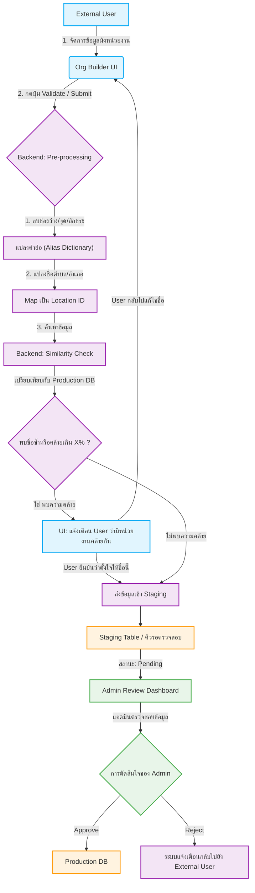
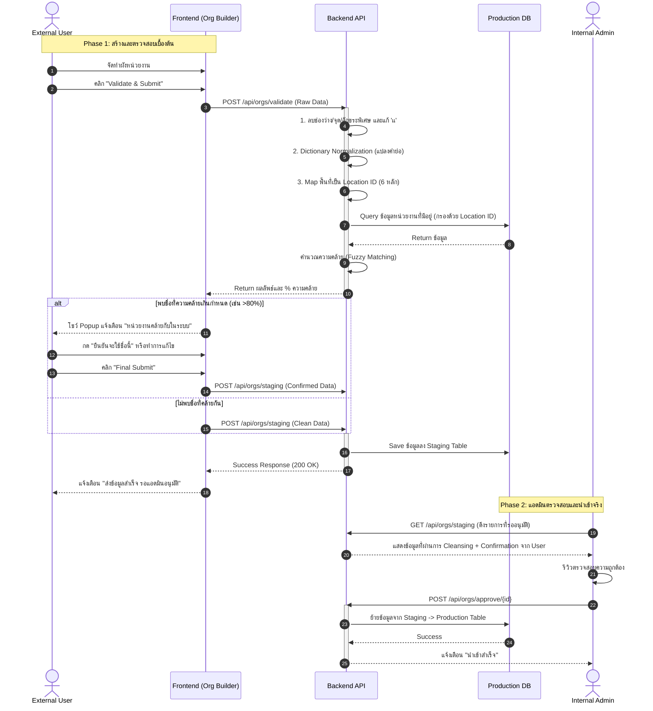

# Organization Chart Creation Tool (Batch Org Create)

เครื่องมือสำหรับจัดเตรียมและวาดผังหน่วยงาน (Organization Chart Builder) ที่ออกแบบมาเพื่อให้ผู้ใช้งานภายนอก (External Users) หรือแอดมิน สามารถสร้าง ลำดับชั้น, นำเข้า/ส่งออกข้อมูลได้อย่างง่ายดาย และเตรียมข้อมูลที่สะอาดเพื่อส่งต่อเข้าสู่ระบบฐานข้อมูลหลัก

## 🚀 สิ่งที่ทำไปแล้ว (Current Features)

1. **Interactive Node Editor:**
   - สร้าง, แก้ไข, ลบ, และเคลื่อนย้ายโหนด (Drag-and-Drop, Move Node).
   - กำหนดชื่อ, ระดับชั้น (Level), และผูกพื้นที่รับผิดชอบ (Areas) ผ่านระบบ Typeahead
2. **Visual & Layout Modes:**
   - **Canvas View:** แสดงผลในรูปแบบ Tree (แนวนอน/แนวตั้ง) พร้อมระบบ Pan & Zoom ด้วยการลากเมาส์ (Mouse Drag) และลูกกลิ้ง (Mouse Scroll).
   - **Table View:** มุมมองตารางสำหรับดูข้อมูลรวมเชิงลึก รองรับการพับเก็บ/ขยายลำดับชั้น (Expand/Collapse).
3. **Pre-processing & Validation (Client-Side):**
   - ระบบแจ้งเตือนเมื่อพบข้อขัดแย้ง (เช่น โหนดไม่มีชื่อ, ไม่ได้กำหนดสังกัด).
   - ปุ่มลบวงกว้าง (ย้ายทั้งสาย หรือ ลบทั้งสาย).
4. **Import/Export Pipeline:**
   - ส่งออกและนำเข้าข้อมูลได้ในรูปแบบ `.json` และ `.xlsx` สำหรับนำไปใช้งานต่อ.

### 🎨 การปรับปรุง UI/UX ล่าสุด (Latest UI/UX Improvements)
- **ระบบ Undo:** เพิ่มปุ่ม Undo เพื่อย้อนกลับการกระทำล่าสุดที่ผิดพลาด ช่วยเพิ่มความปลอดภัยในการแก้ไขข้อมูลโครงสร้างแผนผัง
- **Parent Change Confirmation:** เพิ่ม Modal แบบ 3 สเต็ปในการย้ายต้นสังกัด (เลือกรูปแบบการย้าย -> เลือกต้นสังกัด -> กดยืนยัน) เพื่อให้ผู้ใช้สามารถตรวจสอบข้อมูลความถูกต้องได้ก่อนยืนยันจริง
- **Root Node Support:** สนับสนุนการเปลี่ยน/ตั้งค่าต้นสังกัดใหม่ให้กับหน่วยงานที่เป็น Root (ไม่มีต้นสังกัด)
- **Right Sidebar Re-design:** ปรับปรุงการจัดเรียงในแผงการตั้งค่าใหม่ จัดเรียงตาม ชื่อหน่วยงาน, สายการบังคับบัญชา, พื้นที่รับผิดชอบ, และลูกน้อง พร้อมกับการใช้ ธีมสี Traffy Fondue ตามที่ร้องขอ
- **Node Design Update:** ถอด Icon ออกและเปลี่ยนเป็นปุ่มกดที่ชัดเจนเข้าใจง่าย (ตั้งค่า, ดูหน่วยงานย่อย, เพิ่มหน่วยงาน)
- **Chart Layout Optimization:** ปรับการแสดงผลลูกน้องเป็นแถวละ 5 หน่วยงาน และปรับระยะห่าง (Gap) แนวตั้ง-แนวนอนให้สมมาตร
- **Root Node Highlight:** ขยายขนาดโหนดต้นสังกัด (Parent Node) ให้กว้างขึ้น 2 เท่า เพื่อให้เป็นจุดศูนย์กลางที่โดดเด่น
- **Viewport & Positioning:** แก้ไขปัญหาผังหน่วยงานตกไปอยู่กลางจอ จัดตำแหน่งให้ชิดขึ้นมาอยู่ด้านบน (Top-aligned) เสมอ รวมทั้งตอนโหลด Draft ด้วย
- **Config Panel Reorder:** ปรับปรุงหน้าต่างตั้งค่าหน่วยงาน (Sidebar) ให้รองรับข้อความยาวๆ แบบ Multi-line โดยไม่ถูกตัดคำ และเรียงลำดับหัวข้อ (ชื่อ, ต้นสังกัด, พื้นที่, จำนวนลูกน้อง) ใหม่เพื่อความสะดวก
- **Status Highlight:** แสดงกรอบสีเหลือง/แดงให้เห็นชัดเจนบนโหนดที่มีข้อควรระวัง (Warning) หรือข้อผิดพลาด (Error)

## 🚧 สิ่งที่กำลังจะทำ (Roadmap / Next Steps)

เพื่อให้ระบบสามารถขยายขนาด (Scale) และรองรับการจัดการคุณภาพข้อมูล (Data Quality) ที่มีประสิทธิภาพ จะมีการนำ **Two-Tier Validation Workflow** มาใช้งาน โดยมีแผนงานดังนี้:

1. **Pre-processing (String Sanitization):**
   - ระบบจะทำการลบช่องว่างส่วนเกิน, อักขระพิเศษ, และรวมสระที่ซ้ำกัน (เช่น `เเ` เป็น `แ`) โดยอัตโนมัติ.
2. **Dictionary Normalization:**
   - แปลงคำย่อเป็นคำเต็มมาตรฐาน (เช่น `อบต.` -> `องค์การบริหารส่วนตำบล`) ก่อนตรวจความซ้ำซ้อน.
3. **Location ID Mapping:**
   - แปลงชื่อระดับ ตำบล/อำเภอ/จังหวัด ให้กลายเป็น **รหัสพื้นที่ 6 หลัก (กระทรวงมหาดไทย)** เพื่อป้องกันข้อมูลขยะ (เช่น กทม. vs กรุงเทพมหานคร)
4. **Staging & Admin Review:**
   - ส่งข้อมูลที่ผ่านการ Clean ไปพักใน Staging Database
   - ทำ Fuzzy Matching เพื่อเช็คความคล้ายกับชื่อหน่วยงานที่มีอยู่ในระบบ (แสดงผลให้ User ตัดสินใจล่วงหน้า)
   - แอดมินตรวจสอบ (Review) ครั้งสุดท้ายก่อน นำเข้า (Approve) 

---

## 🏛 System Architecture: Two-Tier Validation Workflow

### 1. Flow Chart (แผนผังกระบวนการ)
การไหลของข้อมูลตั้งแต่หน้าบ้าน จนถึงแอดมินยืนยัน

### 2. Sequence Diagram (ลำดับการประมวลผล)
ลำดับการรับส่งข้อมูลระหว่าง API

## Setup Instructions

1. `npm install`
2. `npm run dev`
